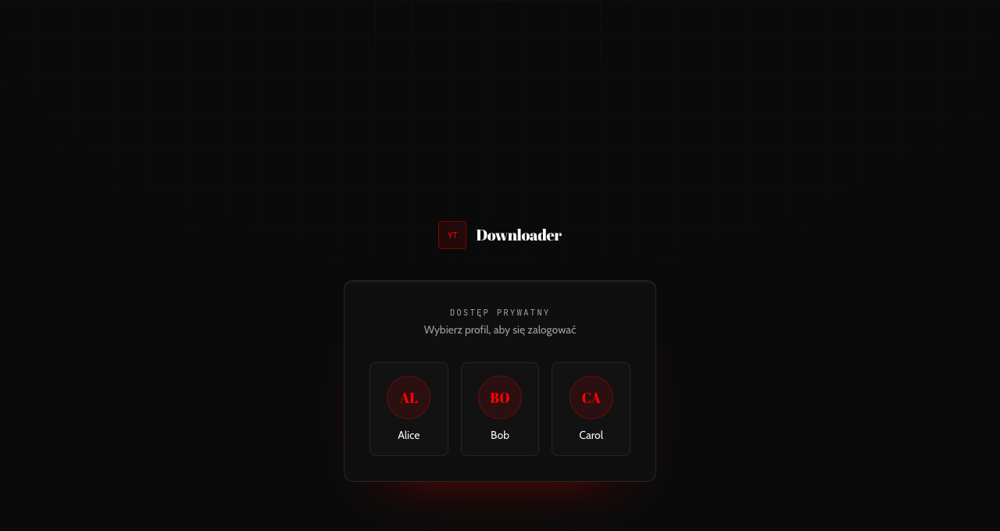
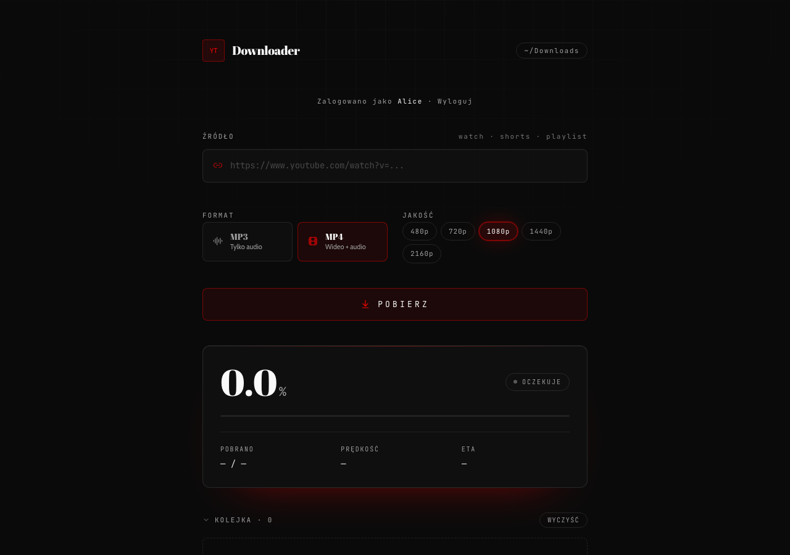

<!--
  future-tech minimal  ·  dark / oklch / aurora
  ━━━━━━━━━━━━━━━━━━━━━━━━━━━━━━━━━━━━━━━━━━━━
-->

<!--╔════════════════════════════════════════╗-->
<!--║  ██╗  ██╗████████╗    ██████╗ ██╗   ██╗  ║-->
<!--║  ╚██╗██╔╝╚══██╔══╝    ██╔══██╗╚██╗ ██╔╝  ║-->
<!--║   ╚███╔╝    ██║       ██████╔╝ ╚████╔╝   ║-->
<!--║  ██╔██╗    ██║       ██╔══██╗  ╚██╔╝    ║-->
<!--║  ██╔╝ ██╗  ██║       ██████╔╝   ██║     ║-->
<!--║  ╚═╝  ╚═╝  ╚═╝       ╚═════╝    ╚═╝     ║-->
<!--║       viewer · downloader · self-host   ║-->
<!--╚════════════════════════════════════════╝-->

<div align="center">

## YT Viewer Redesign

> prywatna, samodzielnie hostowana usługa pobierania z YouTube —
> dark minimal UI, 3 osobne konta, backend na własnym Ubuntu

`localhost · 127.0.0.1 · ~/Downloads`

</div>

---

## O projekcie

Publiczne strony typu „yt-to-mp3” są zaśmiecone reklamami, nie dają
kontroli nad jakością/formatem i oddają Twoje linki cudzemu serwerowi.
**YT Viewer Redesign** to ten sam pomysł, ale w całości na Twojej
infrastrukturze: jeden mały stack Dockera na Ubuntu, za tunelem
Cloudflare, z realnym ekranem logowania zamiast okienka Basic Auth.

Frontend jest prezentacyjny i bezstanowy — cały stan (kolejka, postęp,
sesja) płynie z warstwy logiki opisanej kontraktem w
[`docs/CLAUDE_CONTRACT.md`](docs/CLAUDE_CONTRACT.md); UI jedynie go
renderuje.

**Kluczowe cechy:**

- **3 osobne konta** — ekran logowania w formie profile pickera (jak
  macOS/PS5); worker filtruje zadania per użytkownik na poziomie API, więc
  jedno konto nie widzi ani nie steruje pobraniami drugiego
- **MP3 / MP4** z wyborem jakości — `128–320 kbps` / `480p–2160p`
- **Live postęp** przez SSE (prędkość, ETA, %) z automatycznym fallbackiem
  do pollingu przy zerwanym połączeniu
- **Playlisty** traktowane jako batch wielu zadań, z konfigurowalnym
  limitem długości
- **yt-dlp + ffmpeg + deno** w osobnym, izolowanym workerze (Bun) — deno
  jest wymagany przez yt-dlp do deszyfrowania sygnatur YouTube (n-param);
  opcjonalne wsparcie `cookies.txt`, gdy YouTube blokuje pobieranie
- Zero zależności runtime poza Dockerem — wszystko wbudowane w obrazy,
  `git pull && docker compose up -d --build` i gotowe

---

## Zrzuty ekranu

<div align="center">

**logowanie — profile picker**



**panel pobierania**



</div>

---

## 0. architektura

```
   ┌──────────────────────────────────────────┐
   │                      domena               │
   │              https://yt.twojadomena.pl     │
   └──────────────┬──────────────────┬───────┘
                  ▼                  ▼
            cloudflared        tunel Cloudflare
                  │                  (Zero Trust)
   ┌──────────────┴──────────────────┴─────────┐
   │  app  (port 3000, 127.0.0.1)              │
   │  ├── logowanie (profile picker, 3 konta)   │
   │  ├── gateway /api/public/*                 │
   │  └── proxy ──────────────────────►   worker │
   │        yt-dlp · ffmpeg · deno (port 8081) │
   └──────────────────────────────────────────┘
       wolumen ./downloads → pobrane pliki
```

| warstwa     | opis                                                      |
| ----------- | ---------------------------------------------------------- |
| **app**     | TanStack Start · SSR · `node-server` · logowanie (sesja)   |
| **gateway** | `/api/public/*` → reverse proxy do workera, izolacja per-user |
| **worker**  | yt-dlp + ffmpeg + deno · Bun · SSE + limity                |
| **tunel**   | Cloudflare Tunnel → Twoja poddomena                        |

---

## 1. lokalnie

```bash
bun install
bun run dev          # http://localhost:8080
```

> `vite dev` proxy `/api/*` do workera, jeśli on jest uruchomiony
> (`WORKER_URL=http://127.0.0.1:8081` · `WORKER_TOKEN=dev`). Żeby
> przetestować logowanie lokalnie, dopisz też `SESSION_SECRET` oraz
> `AUTH_USER_1`/`AUTH_PASSWORD_SHA256_1` — szczegóły w
> [`docs/DEPLOY.md`](docs/DEPLOY.md#rozwój-lokalny-bez-dockera).

---

## 2. na Ubuntu Server

pełny przewodnik: [`docs/DEPLOY.md`](./docs/DEPLOY.md)

```bash
git clone https://github.com/pi0trdotsys/yt-viewer-redesign
cd yt-viewer-redesign
cp .env.example .env        # AUTH_USER_1..3 · AUTH_PASSWORD_SHA256_1..3 · SESSION_SECRET · WORKER_TOKEN · TUNNEL_TOKEN
docker compose up -d --build
```

aplikacja pod `127.0.0.1:3000` (za ekranem logowania), pliki w `./downloads/`.

---

## 3. interfejs

- pole — wklej adres YouTube (`watch` · `shorts` · `playlist`)
- format — `mp3` / `mp4`, jakość 480p → 2160p / 128k → 320k
- pasek transferu — pobieranie · konwersja · gotowe
- kolejka — historia w `localStorage` (osobna per konto); pobieraj plik lub ponów

---

## 4. bezpieczeństwo

- **logowanie** — ekran typu profile picker, 3 osobne konta (`AUTH_USER_1..3`),
  sesja w podpisanym (HMAC) ciasteczku `HttpOnly` ważnym 30 dni
- **izolacja per-user** — worker zna właściciela każdego zadania (nagłówek
  `X-User-Id` z gatewaya); jedno konto nie widzi, nie anuluje ani nie
  pobiera plików drugiego
- **WORKER_TOKEN** — app → worker, port workera nie publikowany
- **token joba** — HMAC (SHA-256) chroni SSE i pobieranie pliku
- **limity** — równoległe zadania, długość playlisty, długość filmu,
  rate-limit prób logowania
- **COOKIES_FILE** (opcjonalnie) — plik cookies.txt dla yt-dlp, gdy YouTube
  blokuje pobieranie bez zalogowanej sesji przeglądarki
- opcjonalnie: **Cloudflare Access** przed domeną

---

## 5. tech

| warstwa  | stack                                         |
| -------- | --------------------------------------------- |
| frontend | TanStack Start · React · Tailwind · shadcn/ui |
| logika   | silnik SSE + polling fallback, zod DTO        |
| backend  | Nitro (`node-server`) · Bun                   |
| worker   | yt-dlp · ffmpeg · deno · Bun · Node Streams   |
| devops   | Docker · docker compose · cloudflared         |

---

<div align="center">

built with ☾ · by <a href="https://pi0tr.dev">piotr</a>

<!-- aurora: primary oklch(0.628 0.258 29.2) -->
</div>
